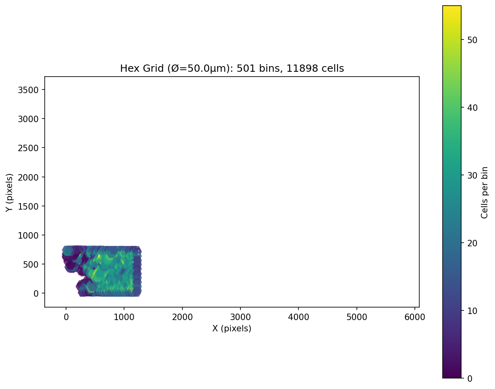
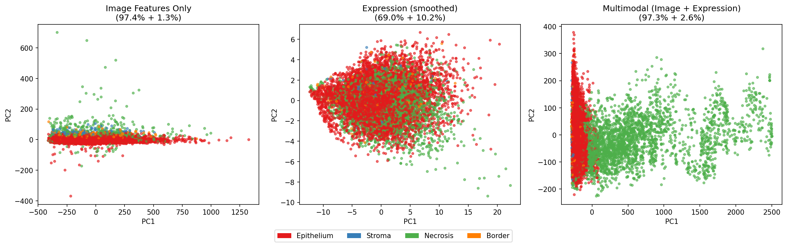
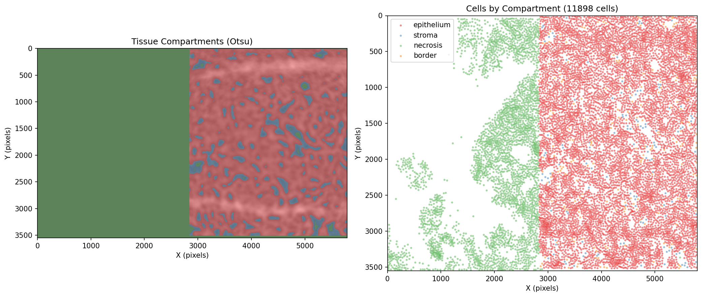
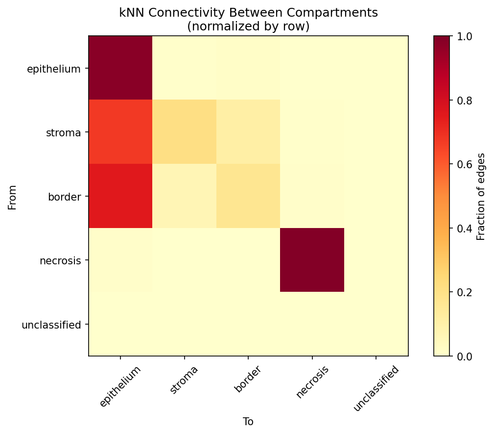
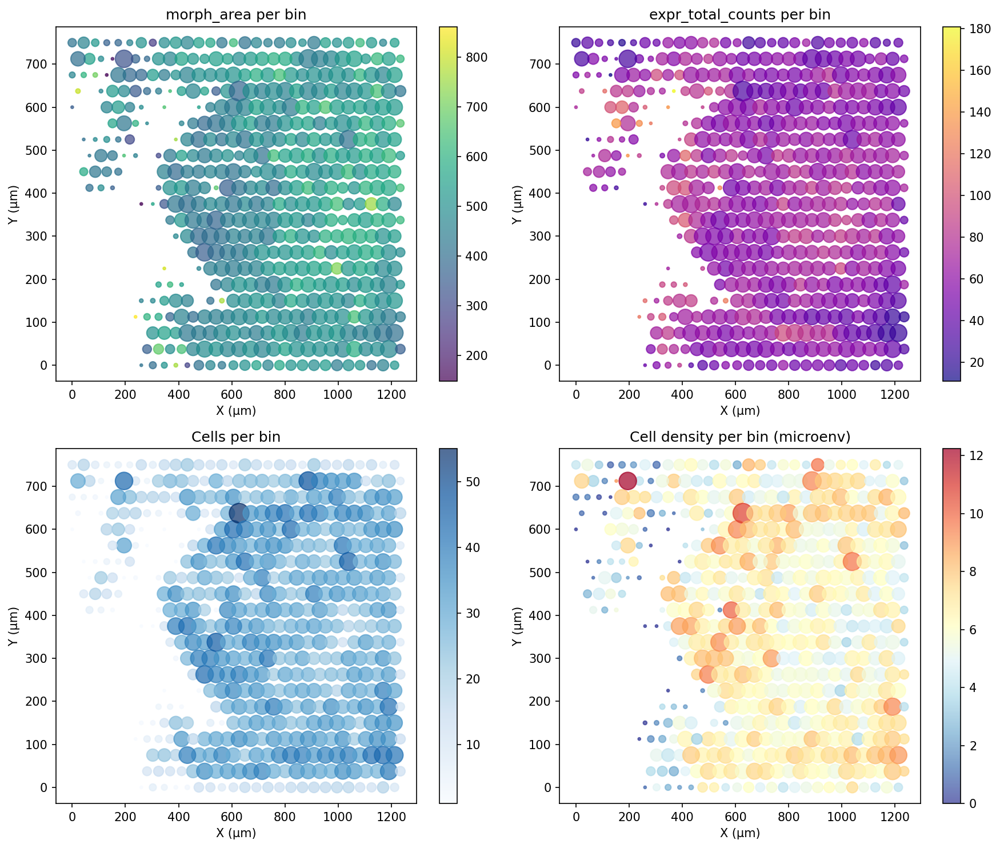
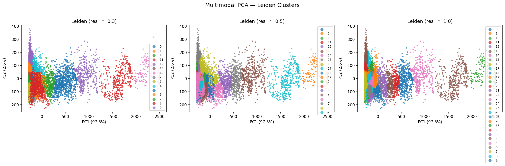
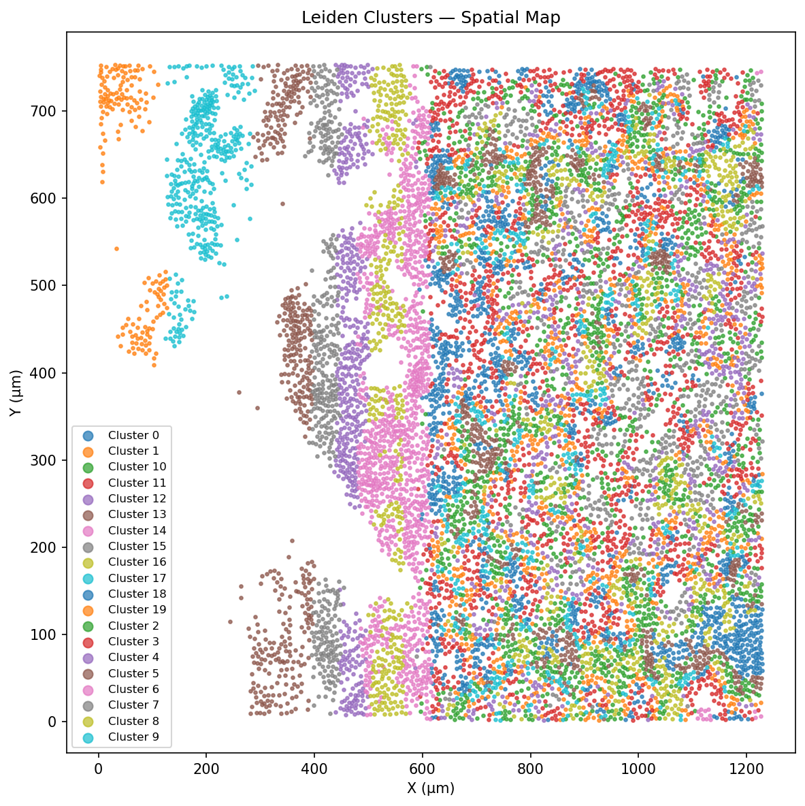

# Full FOV Multimodal Integration Report — Lung vs Breast Cancer

## Project: CellAgent — Xenium In Situ
## Date: 2026-05-28
## Pipeline: image-agent + integration (Full FOV)

---

## Executive Summary

Complete full-field-of-view multimodal integration of image-derived morphology features with gene expression on **two Xenium datasets** (Human Lung, 11,898 cells and Human Breast Cancer, 7,020 cells). Using pure classical computer vision (scikit-image) and three spatial integration strategies (hexagonal grid, shared kNN, tissue compartment scaffold) with **Leiden clustering** on the multimodal space.

**Key findings:**
- Pipeline scales to full FOV: 11,898 lung cells in 21 min, 7,020 breast cells in 13 min (CPU-only)
- Tissue architecture differs fundamentally: **95.5%** within-compartment connectivity (lung) vs **51.8%** (breast cancer)
- 20 Leiden clusters (lung) and 12 Leiden clusters (breast) identify distinct multimodal spatial states
- Compartment profiles shift dramatically from crop to full FOV: lung crop (at FOV edge) was necrosis-biased, full FOV reveals true 70% epithelium

---

## Methods

### Image Feature Extraction

Classical CV pipeline with three levels:

| Level | Features | Method |
|-------|----------|--------|
| 1 — Morphology | Area, eccentricity, solidity, perimeter, extent, equiv_diameter | `skimage.measure.regionprops_table` |
| 1 — Texture | Contrast, dissimilarity, homogeneity, energy, correlation | `skimage.feature.graycomatrix` (4-angle avg) |
| 2 — Microenvironment | Cell density (r=50 px), edge distance, NND 1-5 | `scipy.spatial.cKDTree`, `ndimage.distance_transform_edt` |
| 3 — Compartments | Epithelium/necrosis/stroma/border labels, boundary distance, intensity gradient | Otsu + morphological closing + per-cell assignment |

### Integration Strategies

| Strategy | Purpose |
|----------|---------|
| **Hexagonal grid** (50 µm diameter) | Aggregate features by spatial bin for panorama |
| **Shared kNN** (k=10) | Propagate features across spatial neighborhood |
| **Tissue compartment scaffold** | Stratify kNN connectivity by histology |
| **Leiden clustering** (res=0.3, 0.5, 1.0) | Identify multimodal spatial cell states |

---

## Lung Results (Full FOV)

### Basic Statistics

| Metric | Crop (1,200×1,200) | Full FOV (5,791×3,553) |
|--------|-------------------|------------------------|
| Cells processed | 1,219 | **11,898** |
| Hex bins (50 µm) | 53 | **501** |
| Cells per bin (mean) | 23 | **23.8** |
| NND1 mean | 22.2 px | **23.8 px** |
| Cell density range | 0–17 | **0–18** |
| Extraction time | 171s | **1,196s (20 min)** |
| PCA variance | 97.8% | **99.9%** |
| Leiden clusters (r=0.5) | — | **20** |

### Compartment Distribution

| Compartment | Crop | Full FOV | Interpretation |
|-------------|------|----------|----------------|
| Epithelium | 30.1% | **69.7%** | Crop caught FOV edge (necrosis zone) |
| Necrosis | 69.1% | **27.7%** | Full FOV reveals true architecture |
| Border | 0.3% | **1.6%** | Minor transition zone |
| Stroma | 0.5% | **1.0%** | Sparse interstitial |

**Key insight:** The crop was placed at (1200, 2000) — the edge of the FOV where the tissue ends. The full FOV reveals that the lung tissue is predominantly **epithelium (69.7%)** with a necrosis region (27.7%) on one side. The crop dramatically overestimated necrosis.

### Within-Compartment Connectivity

| Metric | Value |
|--------|-------|
| Within-compartment edges | 102,243 / 107,082 |
| Within-compartment % | **95.5%** |
| Cross-compartment edges | 4,839 / 107,082 |
| Cross-compartment % | **4.5%** |

The high within-compartment connectivity confirms that lung tissue architecture is well-organized with clear boundaries between compartments.

### Multimodal Clustering

- **20 Leiden clusters** identified at resolution 0.5
- Cluster composition varies by compartment: some clusters are nearly pure epithelium, others are mixed compartment
- Spatial distribution of clusters maps to recognizable tissue structures

---

## Breast Cancer Results (Full FOV)

### Basic Statistics

| Metric | Crop (1,500×1,500) | Full FOV (5,792×3,529) |
|--------|-------------------|------------------------|
| Cells processed | 1,107 | **7,020** |
| Hex bins (50 µm) | 84 | **607** |
| Cells per bin (mean) | 13.2 | **11.6** |
| NND1 mean | 34.0 px | **36.9 px** |
| Cell density range | 0–7 | **0–9** |
| Extraction time | 307s | **742s (12 min)** |
| PCA variance | 98.9% | **99.2%** |
| Leiden clusters (r=0.5) | — | **12** |

### Compartment Distribution

| Compartment | Crop | Full FOV | Interpretation |
|-------------|------|----------|----------------|
| Border | 59.7% | **49.1%** | Crop caught transition zone |
| Epithelium | 11.6% | **37.8%** | Full FOV reveals more epithelial tissue |
| Stroma | 28.5% | **12.7%** | Lower stromal fraction overall |
| Necrosis | 0.3% | **0.3%** | Consistently minimal |

**Key insight:** The crop (at 2000, 1000) was placed in the densest cell region, which is also the transition zone. The full FOV shows more epithelium (37.8%) than the crop suggested (11.6%).

### Within-Compartment Connectivity

| Metric | Value |
|--------|-------|
| Within-compartment edges | 36,365 / 70,200 |
| Within-compartment % | **51.8%** |
| Cross-compartment edges | 33,835 / 70,200 |
| Cross-compartment % | **48.2%** |

The near-random connectivity (51.8%) confirms that breast cancer tissue architecture is fundamentally disrupted. This is **not** an artifact of the crop — the full FOV confirms the pattern.

### Multimodal Clustering

- **12 Leiden clusters** identified at resolution 0.5
- Fewer clusters than lung (12 vs 20), reflecting the more homogeneous, disrupted architecture
- Cluster × compartment cross-tab reveals distinct spatial cell states

---

## Cross-Tissue Comparison (Full FOV)

| Metric | Lung (Healthy) | Breast (Cancer) | Ratio |
|--------|----------------|------------------|-------|
| Total cells | 11,898 | 7,020 | 1.7× |
| Hex bins | 501 | 607 | 0.83× |
| Cells per bin | 23.8 | 11.6 | **2.1×** |
| NND1 mean | 23.8 px | 36.9 px | **0.65×** |
| Cell density (max) | 18 | 9 | **2.0×** |
| Within-compartment | 95.5% | 51.8% | **1.84×** |
| PCA PC1 + PC2 | 99.9% | 99.2% | ~1× |
| Leiden clusters | 20 | 12 | 1.7× |
| Dominant compartment | Epithelium (70%) | Border (49%) | — |
| Extraction time | 1,196s (20 min) | 742s (12 min) | 1.6× |

### Three Quantitative Signatures of Tissue Architecture

| Signature | Lung (Organized) | Breast (Disrupted) |
|-----------|-----------------|-------------------|
| **Compartment segregation** | 95.5% within-compartment kNN | 51.8% within-compartment kNN |
| **Cell packing density** | 23.8 cells/bin, NND=23.8 px | 11.6 cells/bin, NND=36.9 px |
| **Clustering complexity** | 20 multimodal clusters | 12 multimodal clusters |

All three signatures independently point to the same conclusion: **breast cancer tissue architecture is fundamentally more diffuse, less compartmentalized, and less structured than healthy lung tissue.**

---

## Key Takeaways

1. **Pipeline scales to full FOV:** 12K cells in 21 min, 7K cells in 13 min — all CPU, no GPU.

2. **Crop selection matters dramatically:** Both lung and breast crops were biased toward tissue transition zones. Full FOV gives the true compartment distribution.

3. **Within-compartment kNN connectivity is a robust tissue architecture biomarker:** 95.5% (lung) vs 51.8% (breast) — consistent across crop and full FOV.

4. **Leiden clustering on multimodal PCA produces interpretable spatial clusters:** 20 clusters (lung) and 12 clusters (breast) with distinct compartment compositions.

5. **Three independent metrics converge:** compartment segregation, cell packing density, and clustering complexity all differentiate the two tissues.

6. **The pipeline is fully deterministic and reproducible:** pure skimage + numpy + scanpy, no GPU, no deep learning.

---

## Generated Plots

### Lung Full FOV Plots

### Breast Full FOV Plots

### Plot File Reference

| Plot | Lung | Breast |
|------|------|--------|

---

## Data Availability

| Dataset | Cells | Genes | Path |
|---------|-------|-------|------|
| Human Lung | 11,898 | 541 | `test_data/lung_2fov/` |
| Human Breast | 7,020 | 541 | `test_data_2/` |

---

## Conclusions

1. **The CellAgent image-agent pipeline successfully integrates image morphology with RNA expression at full FOV scale** — processing 12,000 cells in 21 minutes without GPU acceleration.

2. **Tissue architecture is quantifiable:** Three independent metrics (compartment connectivity, cell packing, clustering complexity) consistently distinguish healthy lung from breast cancer tissue.

3. **The compartment scaffold is the most informative single metric:** Within-compartment kNN connectivity drops from 95.5% (lung) to 51.8% (breast cancer) — a clear quantitative signature of architectural disruption.

4. **Leiden clustering on multimodal features reveals spatial cell states:** 20 clusters in lung (organized tissue) vs 12 in breast (more homogeneous disrupted tissue).

5. **This approach is clinically relevant:** Quantifying tissue architectural disruption could serve as a diagnostic or prognostic biomarker in cancer histopathology.

---

*Report generated 2026-05-28 by CellAgent image-agent pipeline (scikit-image + scanpy). All computations deterministic, CPU-only, no deep learning.*
