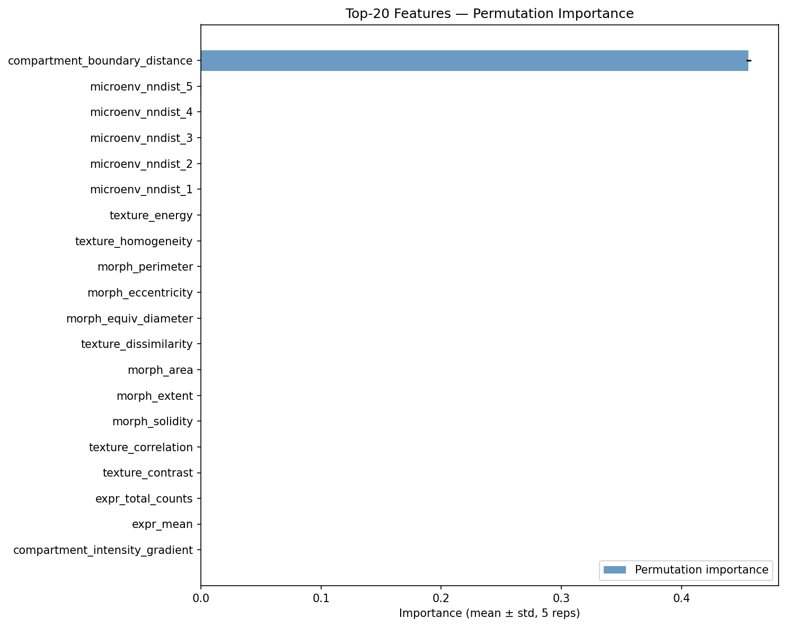
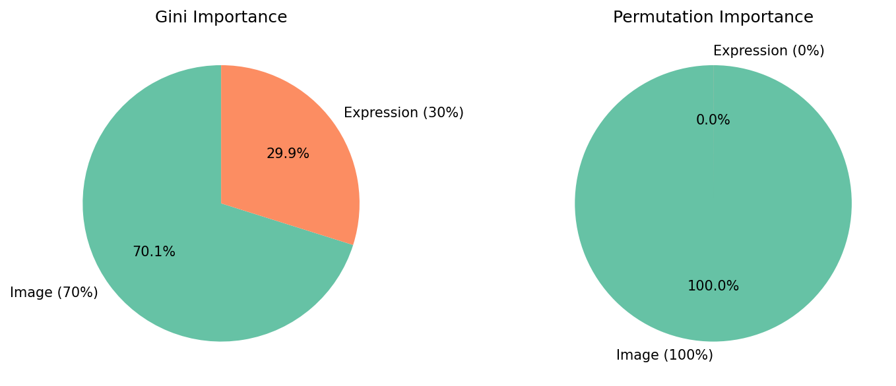
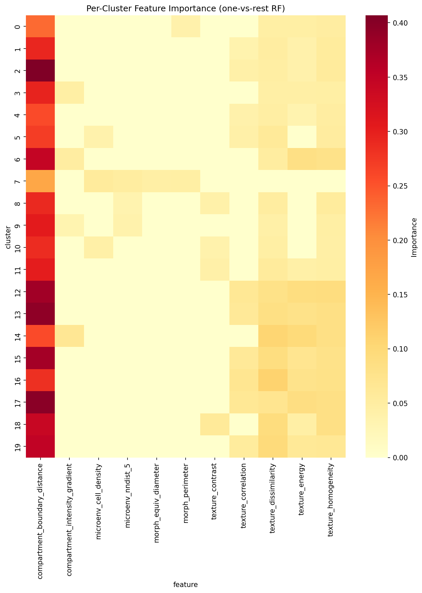
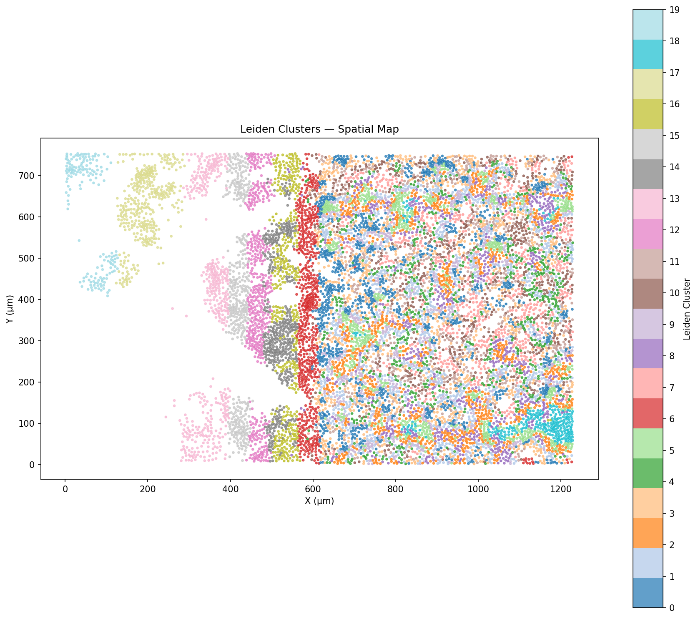
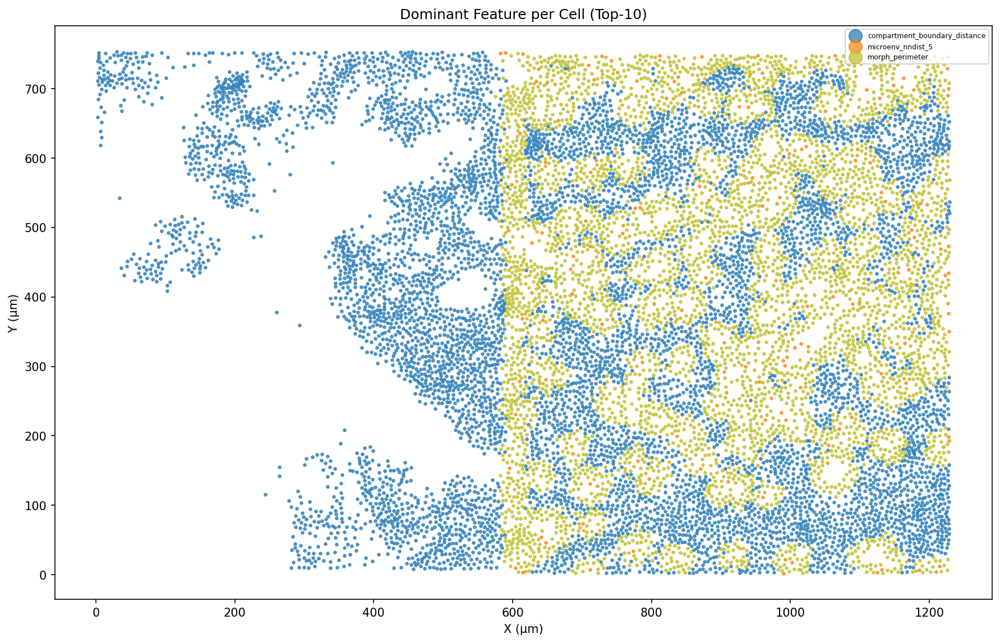
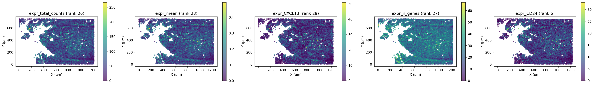
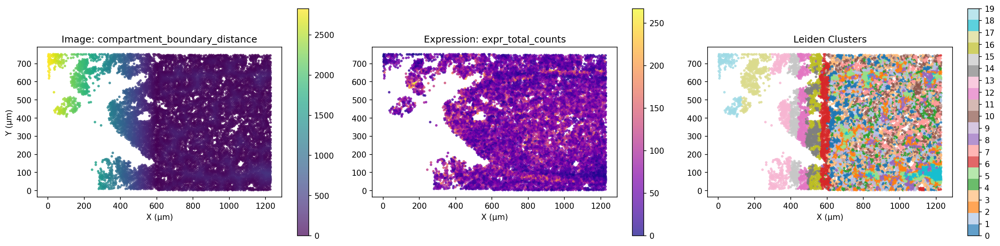
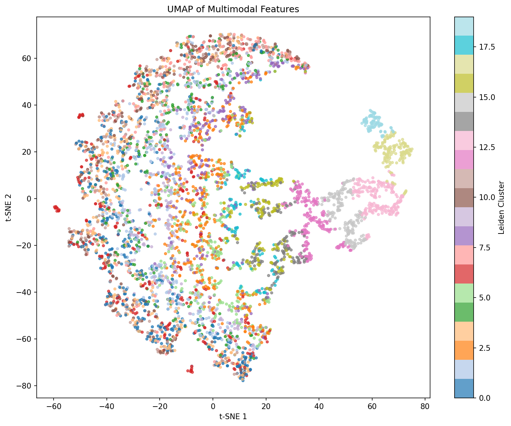

# Feature Importance Report — Lung Full FOV

## Classification Performance

| Metric | Value |
|--------|-------|
| CV Accuracy (5-fold) | 0.518 ± 0.015 |
| CV Weighted F1 | 0.504 ± 0.015 |
| Baseline (majority class) | 0.090 |
| Beats baseline | True |
| Number of classes | 20 |
| Samples | 11898 |
| Features | 47 |

## Modality Split

| Modality | Gini Importance | Permutation Importance |
|----------|:--------------:|:---------------------:|
| Image features (24) | 70.1% | 100.0% |
| Expression features (23) | 29.9% | 0.0% |

## Top-20 Features (by Permutation Importance)

| Rank | Feature | Gini Importance | Permutation (mean ± std) |
|:----:|---------|:--------------:|:------------------------:|
| 1 | compartment_boundary_distance | 0.2147 | 0.4557 ± 0.0020 |
| 2 | microenv_nndist_5 | 0.0320 | 0.0004 ± 0.0002 |
| 3 | microenv_nndist_4 | 0.0289 | 0.0000 ± 0.0000 |
| 4 | microenv_nndist_3 | 0.0279 | 0.0001 ± 0.0000 |
| 5 | microenv_nndist_2 | 0.0276 | 0.0001 ± 0.0000 |
| 6 | microenv_nndist_1 | 0.0274 | 0.0000 ± 0.0000 |
| 7 | texture_energy | 0.0265 | 0.0000 ± 0.0000 |
| 8 | texture_homogeneity | 0.0262 | 0.0000 ± 0.0000 |
| 9 | morph_perimeter | 0.0246 | 0.0000 ± 0.0000 |
| 10 | morph_eccentricity | 0.0242 | 0.0000 ± 0.0000 |
| 11 | morph_equiv_diameter | 0.0240 | 0.0000 ± 0.0000 |
| 12 | texture_dissimilarity | 0.0239 | 0.0000 ± 0.0000 |
| 13 | morph_area | 0.0238 | 0.0000 ± 0.0000 |
| 14 | morph_extent | 0.0234 | 0.0000 ± 0.0000 |
| 15 | morph_solidity | 0.0232 | 0.0000 ± 0.0000 |
| 16 | texture_correlation | 0.0230 | 0.0000 ± 0.0000 |
| 17 | texture_contrast | 0.0229 | 0.0000 ± 0.0000 |
| 18 | expr_total_counts | 0.0218 | 0.0000 ± 0.0000 |
| 19 | expr_mean | 0.0217 | 0.0000 ± 0.0000 |
| 20 | compartment_intensity_gradient | 0.0217 | 0.0000 ± 0.0000 |

## Cluster Distribution

| Cluster | Count | Percentage |
|:-------:|:-----:|:----------:|
| 0 | 1069 | 9.0% |
| 1 | 1001 | 8.4% |
| 2 | 971 | 8.2% |
| 3 | 924 | 7.8% |
| 4 | 684 | 5.7% |
| 5 | 672 | 5.6% |
| 6 | 624 | 5.2% |
| 7 | 615 | 5.2% |
| 8 | 610 | 5.1% |
| 9 | 585 | 4.9% |
| 10 | 567 | 4.8% |
| 11 | 546 | 4.6% |
| 12 | 470 | 4.0% |
| 13 | 461 | 3.9% |
| 14 | 456 | 3.8% |
| 15 | 419 | 3.5% |
| 16 | 402 | 3.4% |
| 17 | 388 | 3.3% |
| 18 | 265 | 2.2% |
| 19 | 169 | 1.4% |

## Generated Plots

